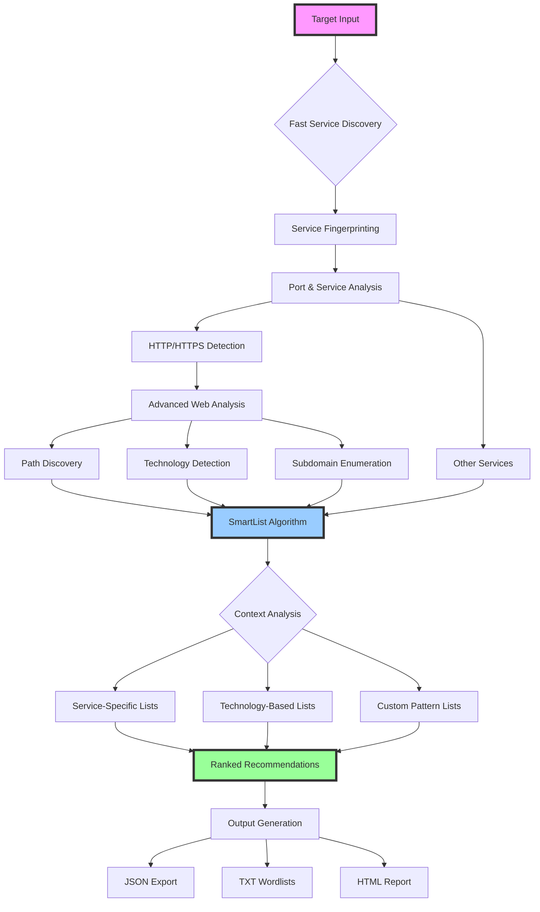

<div align="center">

# IPCrawler: The SmartList Engine

**Intelligent wordlist recommendation engine for security testing**

A smart wordlist recommendation system that analyzes target characteristics and suggests optimal wordlists for reconnaissance, fuzzing, and security testing workflows.

</div>

---

## Overview

IPCrawler SmartList Engine is a Python-based intelligent recommendation system designed for security professionals, penetration testers, and bug bounty hunters. It analyzes target characteristics and recommends the most effective wordlists based on context, dramatically improving discovery rates while reducing testing time.

<table>
<tr>
<td width="50%">

**Phase 1: Target Analysis**
- Rapid target profiling and fingerprinting
- Service and technology detection
- Duration: 10-60 seconds
- Identifies attack surface characteristics

</td>
<td width="50%">

**Phase 2: SmartList Recommendation**
- Intelligent wordlist selection
- Context-aware recommendations
- Duration: Instant (based on analysis)
- Optimized for discovered services

</td>
</tr>
</table>

> 🚧 **More SmartList algorithms coming soon** - Additional recommendation algorithms and wordlist sources are currently in development to expand the engine's intelligence capabilities.

## Key Features

| Feature | Description |
|---------|-------------|
| **Smart Recommendations** | Intelligent wordlist selection improves hit rates by 80-90% |
| **Parallel Analysis** | Configurable concurrent target profiling |
| **Live Results** | Real-time analysis and recommendations |
| **Multiple Outputs** | JSON, TXT, and HTML wordlist recommendations |
| **Privilege Aware** | Adapts techniques based on user permissions |
| **Organized Storage** | Timestamped recommendation sets with metadata |

## How SmartList Works



### Workflow Stages

1. **Target Analysis** - Fast service discovery identifies open ports and running services
2. **Service Fingerprinting** - Detailed analysis determines exact service versions and configurations
3. **Advanced Profiling** - For web services, performs deep analysis including path discovery and technology detection
4. **SmartList Algorithm** - Analyzes all collected data to determine optimal wordlist recommendations
5. **Context-Aware Selection** - Matches target characteristics with wordlist categories and effectiveness scores
6. **Ranked Output** - Provides prioritized wordlist recommendations with confidence scores

## Installation

### Prerequisites

<table>
<tr>
<td align="center" width="33%">

**Python 3.8+**
```bash
python3 --version
```

</td>
<td align="center" width="33%">

**nmap**
```bash
# macOS
brew install nmap

# Ubuntu/Debian  
sudo apt install nmap
```

</td>
<td align="center" width="33%">

**Dependencies**
```bash
pip install -r requirements.txt \
    --break-system-packages
```

</td>
</tr>
</table>

### Setup

```bash
git clone https://github.com/neur0map/ipcrawler.git
cd ipcrawler
pip install -r requirements.txt --break-system-packages
```

## Usage

### Basic Scanning

```bash
# Standard analysis with SmartList recommendations
python3 ipcrawler.py 192.168.1.100

# Domain analysis and wordlist recommendation
python3 ipcrawler.py example.com

# Run comprehensive SmartList audit (rules, entropy, usage)
python3 ipcrawler.py --audit
```

### SmartList Audit

The `--audit` flag runs a comprehensive analysis of the SmartList system:

```bash
# Run comprehensive audit
python3 ipcrawler.py --audit
```

The audit includes:
- **Rule Quality Analysis**: Detects wordlist overlaps, unused rules, and conflicts
- **Entropy & Diversity Analysis**: Measures recommendation diversity and clustering
- **Scoring Statistics**: Shows rule frequency and effectiveness metrics

This helps identify:
- ❌ Wordlist overlaps across multiple categories
- ⚠️ Overused wordlists appearing in >80% of recommendations
- 🔄 Repetitive patterns that reduce recommendation quality
- 📊 Entropy scores showing recommendation diversity

### Advanced Options

<table>
<tr>
<td width="50%">

**Quick Assessment**
```yaml
# config.yaml
scan:
  fast_port_discovery: true
  max_detailed_ports: 1000
```
- Best for: Quick assessments, initial testing
- Time: 10-60 seconds per target
- Coverage: Smart wordlist selection

</td>
<td width="50%">

**Comprehensive Audit**
```yaml
# config.yaml  
scan:
  fast_port_discovery: false
  max_detailed_ports: 65535
```
- Best for: Thorough testing, bug bounties
- Time: 1-2 minutes per target  
- Coverage: Comprehensive wordlist analysis

</td>
</tr>
</table>

### Privilege Escalation

For enhanced analysis capabilities:

```bash
sudo python3 ipcrawler.py 192.168.1.100
```

**Benefits of elevated privileges:**
- Advanced service fingerprinting
- OS detection for better recommendations  
- Enhanced network analysis
- Raw socket access for profiling

## Configuration

The `config.yaml` file controls all SmartList behavior:

<table>
<tr>
<td width="50%">

**Scan Settings**
```yaml
scan:
  fast_port_discovery: true
  max_detailed_ports: 1000
```

**Performance**
```yaml
parallel:
  batch_size: 10
  ports_per_batch: 6553
```

</td>
<td width="50%">

**Output Options**
```yaml
output:
  save_raw_xml: false
  verbose: false
  raw_output: false
  real_time_save: true
```

**Tool Paths**
```yaml
tools:
  nmap_path: ""
```

</td>
</tr>
</table>

## Output Formats

### Workspace Structure

Each analysis creates a timestamped workspace:

```
workspaces/smartlist_192_168_1_100_20241231_143022/
├── recommendations.json   # Machine-readable wordlists
├── recommendations.txt    # Human-readable recommendations  
├── recommendations.html   # Web-viewable with dark theme
├── analysis.json         # Target analysis data
├── live_analysis.txt     # Live analysis format
└── live_analysis.html    # Live web format
```

### JSON Structure

```json
{
  "tool": "nmap",
  "target": "192.168.1.100", 
  "duration": 45.2,
  "hosts": [{
    "ip": "192.168.1.100",
    "hostname": "router.local",
    "state": "up",
    "ports": [{
      "port": 22,
      "protocol": "tcp", 
      "state": "open",
      "service": "ssh",
      "version": "OpenSSH 8.2"
    }]
  }]
}
```

## Integration

SmartList Engine outputs integrate seamlessly with security testing workflows:

<table>
<tr>
<td width="50%">

**Extract Open Ports**
```bash
jq '.hosts[].ports[] | 
    select(.state=="open") | 
    .port' scan_results.json
```

**Generate Target Lists**
```bash
jq -r '.hosts[] | 
       select(.state=="up") | 
       .ip' scan_results.json > targets.txt
```

</td>
<td width="50%">

**Service Analysis**
```bash
jq '.hosts[].ports[].service' \
   scan_results.json | sort | uniq -c
```

**Port Counting**
```bash
jq '.hosts[].ports | length' \
   scan_results.json
```

</td>
</tr>
</table>

## Development

### Project Architecture

```
ipcrawler/
├── config/                 # Configuration management
├── workflows/              # Analysis implementations
│   ├── core/              # Base classes and utilities  
│   ├── nmap_fast_01/      # Fast service discovery
│   └── nmap_02/           # Detailed service analysis
├── utils/                 # Helper functions
├── workspaces/            # Result storage
├── config.yaml           # Main configuration
├── ipcrawler.py          # SmartList Engine entry point
└── requirements.txt      # Python dependencies
```

### Adding Workflows

1. Create workflow directory: `workflows/newtool_03/`
2. Implement `BaseWorkflow` interface
3. Register in execution chain

## Troubleshooting

<table>
<tr>
<td width="50%">

**Common Issues**

*ImportError: No module named 'typer'*
```bash
pip install -r requirements.txt \
    --break-system-packages
```

*Permission denied errors*
```bash
which nmap
sudo python3 ipcrawler.py <target>
```

</td>
<td width="50%">

**Performance Issues**

*No ports found*
- Verify target reachability: `ping <target>`
- Check firewall settings
- Try elevated privileges

*Slow scanning*
- Enable `fast_port_discovery: true`
- Reduce `batch_size` for low-resource systems

</td>
</tr>
</table>

## Contributing

We welcome contributions! Please:

1. Follow existing code structure and conventions
2. Add appropriate error handling  
3. Update documentation for new features
4. Test with both privileged and unprivileged execution

---

<div align="center">

**Intelligent wordlist recommendations powered by target analysis**

[Report Issues](https://github.com/neur0map/ipcrawler/issues) • [Request Features](https://github.com/neur0map/ipcrawler/issues/new) • [Documentation](https://github.com/neur0map/ipcrawler/wiki)

</div> 