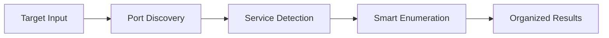

<div align="center">

# 🕷️ ipcrawler

**Smart Network Reconnaissance Made Simple**

[](https://github.com/neur0map/ipcrawler)
[](https://www.python.org)
[](LICENSE)
[](#)

*"It's like bowling with bumpers."* - [@ippsec](https://twitter.com/ippsec)

### 🤖 Get AI-Powered Repository Summary

<div align="center">

Get a quick, easy-to-read overview of this project from top AI providers:

<a href="https://chatgpt.com/?q=Analyze%20this%20GitHub%20repo%20%28https%3A%2F%2Fgithub.com%2Fneur0map%2Fipcrawler%29%20and%20give%20me%20a%20SHORT%2C%20clear%20summary%3A%0A%0A%E2%80%A2%20What%20it%20does%20%28main%20purpose%29%0A%E2%80%A2%20Key%20features%20%26%20why%20it%27s%20useful%0A%E2%80%A2%20How%20to%20install%20%28quick%20steps%29%0A%E2%80%A2%20Who%20should%20use%20it%20%26%20when%0A%E2%80%A2%20System%20requirements%0A%0AKeep%20it%20concise%20but%20include%20the%20important%20stuff.%20Make%20it%20beginner-friendly.">
  
</a>

<a href="https://grok.com/?q=Analyze%20this%20GitHub%20repo%20%28https%3A%2F%2Fgithub.com%2Fneur0map%2Fipcrawler%29%20and%20give%20me%20a%20SHORT%2C%20clear%20summary%3A%0A%0A%E2%80%A2%20What%20it%20does%20%28main%20purpose%29%0A%E2%80%A2%20Key%20features%20%26%20why%20it%27s%20useful%0A%E2%80%A2%20How%20to%20install%20%28quick%20steps%29%0A%E2%80%A2%20Who%20should%20use%20it%20%26%20when%0A%E2%80%A2%20System%20requirements%0A%0AKeep%20it%20concise%20but%20include%20the%20important%20stuff.%20Make%20it%20beginner-friendly.">
  
</a>

*Get a quick AI explanation of this network reconnaissance tool - just click a button above!*

</div>

</div>

---

## What is ipcrawler?

ipcrawler is an **intelligent multi-threaded network reconnaissance tool** that automates the tedious parts of penetration testing. Instead of manually running dozens of enumeration commands, ipcrawler discovers services and automatically launches the right tools for comprehensive reconnaissance.
Beginner friendlier fork of AutoRecon

**Perfect for:** OSCP exam prep, CTFs, penetration testing, and security research.

### 🎯 How it Works



1. **Discover** - Scans ports and identifies running services
2. **Enumerate** - Automatically runs appropriate tools for each service found
3. **Organize** - Creates structured output directories with all results
4. **Suggest** - Provides manual commands for advanced testing

---

## ⚡ Quick Start

### Automated Installation (System-wide)

```bash
git clone https://github.com/neur0map/ipcrawler.git
cd ipcrawler
make install          # Installs tools system-wide
ipcrawler --version   # Test installation
```

### Manual Setup (No System Changes)

```bash
git clone https://github.com/neur0map/ipcrawler.git
cd ipcrawler
pip install -r requirements.txt
python3 ipcrawler.py --version  # Test setup
```

### Basic Usage

```bash
# With automated installation
ipcrawler 192.168.1.100
ipcrawler 192.168.1.0/24
ipcrawler -vv target.com

# With manual setup  
python3 ipcrawler.py 192.168.1.100
python3 ipcrawler.py 192.168.1.0/24
python3 ipcrawler.py -vv target.com
```

### Example Output Structure
```
results/192.168.1.100/
├── scans/           # All enumeration results
│   ├── tcp80/       # HTTP enumeration
│   ├── tcp22/       # SSH enumeration
│   └── tcp445/      # SMB enumeration
├── report/          # Clean reports and screenshots
├── loot/           # Extracted credentials/data
└── exploit/        # Exploit development workspace
```

---

## 🚀 Key Features

<table>
<tr>
<td width="50%">

### 🎯 **Smart Automation**
- **70+ specialized plugins** organized by reconnaissance phases
- **Automatic tool selection** based on discovered services
- **Multi-threaded execution** for faster results
- **Real-time progress** monitoring and control

</td>
<td width="50%">

### 🛠️ **Flexible & Extensible**
- **Plugin-based architecture** for easy customization
- **TOML configuration** for personal preferences
- **Manual command suggestions** for advanced techniques
- **IPv6 support** and **proxychains compatibility**

</td>
</tr>
</table>

### Supported Services & Tools

| Category | Tools & Techniques |
|----------|-------------------|
| **Web Services** | feroxbuster, gobuster, nikto, whatweb, wpscan |
| **Network Services** | nmap scripts, SSL analysis, DNS enumeration |
| **Database Services** | MySQL, MSSQL, Oracle, MongoDB, Redis enumeration |
| **File Services** | SMB, NFS, FTP enumeration and vulnerability checks |
| **Authentication** | LDAP, Kerberos, Active Directory reconnaissance |

---

## 📋 Requirements & Installation

### System Requirements
- **Python 3.8+**
- **Linux/macOS** (Windows via WSL--NOT FULLY TESTED)
- **Root privileges** (for SYN scanning and UDP)

### 🚨 Installation Options

<details>
<summary><b>⚡ Automated Installation (Recommended)</b></summary>

The `make install` command automatically handles ALL dependencies and system setup:

```bash
git clone https://github.com/neur0map/ipcrawler.git
cd ipcrawler
make install
```

**What `make install` does:**
- Installs Python dependencies via pipx (isolated environment)
- Downloads and installs penetration testing tools
- Clones SecLists wordlists to `/usr/share/seclists` (or `~/tools/SecLists`)
- Adds tool binaries to system PATH
- Creates configuration directories

**⚠️ System Modifications Warning:**
This command modifies your system by installing packages and tools to:
- `/usr/local/bin/` - Tool binaries (gobuster, feroxbuster, etc.)
- `/usr/share/seclists/` - SecLists wordlist repository
- `/opt/` - Additional tools and resources
- System package manager (apt, brew, pacman)

**Make Commands Available:**
- `make install` - Full installation with tools and dependencies
- `make clean` - Remove ipcrawler only (keeps tools and results)
- `make clean-all` - Remove everything including installed tools
- `make debug` - Show system diagnostics and tool availability
- `make help` - Show all available commands

</details>

<details>
<summary><b>🛡️ Manual Setup (No System Modifications)</b></summary>

If you prefer not to modify system files or are using a restricted environment:

```bash
git clone https://github.com/neur0map/ipcrawler.git
cd ipcrawler
pip install -r requirements.txt
python3 ipcrawler.py --version
```

**Run scans directly:**
```bash
python3 ipcrawler.py 192.168.1.100
python3 ipcrawler.py -vv target.com
```

**Required Tools for Manual Setup:**

<details>
<summary>Essential Tools (Core functionality)</summary>

- **nmap** - Port scanning and service detection
- **curl** - HTTP requests and web testing
- **python3** - Runtime environment
- **git** - Repository management

**Installation:**
```bash
# Ubuntu/Debian
sudo apt install nmap curl python3 git

# macOS
brew install nmap curl python3 git

# Arch Linux
sudo pacman -S nmap curl python3 git
```

</details>

<details>
<summary>Web Enumeration Tools (Recommended)</summary>

- **feroxbuster** - Fast directory/file discovery
- **gobuster** - Directory/DNS enumeration  
- **nikto** - Web vulnerability scanner
- **whatweb** - Web technology identification

**Installation:**
```bash
# Ubuntu/Debian
sudo apt install feroxbuster gobuster nikto

# Install from GitHub if not available:
# Feroxbuster: https://github.com/epi052/feroxbuster/releases
# Gobuster: https://github.com/OJ/gobuster/releases
```

</details>

<details>
<summary>Network Enumeration Tools (Optional)</summary>

- **dnsrecon** - DNS enumeration
- **enum4linux** - SMB/NetBIOS enumeration
- **smbclient** - SMB client testing
- **nbtscan** - NetBIOS name scanning
- **onesixtyone** - SNMP scanning

**Installation:**
```bash
# Ubuntu/Debian
sudo apt install dnsrecon enum4linux smbclient nbtscan onesixtyone

# Alternative enum4linux-ng:
git clone https://github.com/cddmp/enum4linux-ng.git
```

</details>

<details>
<summary>Database Tools (Optional)</summary>

- **mysql-client** - MySQL enumeration
- **redis-tools** - Redis enumeration
- **impacket-scripts** - Windows/AD tools

**Installation:**
```bash
# Ubuntu/Debian
sudo apt install mysql-client redis-tools impacket-scripts

# Or via pip:
pip3 install impacket
```

</details>

**SecLists Wordlists (Required for many plugins):**

```bash
# Clone to home directory
git clone https://github.com/danielmiessler/SecLists.git ~/tools/SecLists

# Or system-wide (requires sudo)
sudo git clone https://github.com/danielmiessler/SecLists.git /usr/share/seclists
```

**Verify Manual Setup:**
```bash
python3 ipcrawler.py --version
python3 ipcrawler.py -l  # List available plugins
```

</details>

### Platform Support
- **Full Support:** Kali Linux, Ubuntu, Debian
- **Partial Support:** macOS (limited tool availability)
- **Basic Support:** Arch Linux, RedHat/CentOS

> **💡 Pro Tip:** For VM environments or when you want to avoid system modifications, use the manual setup with `python3 ipcrawler.py`

---

## 🎮 Usage Examples

### Target Specification
```bash
# Single IP
ipcrawler 10.10.10.1

# CIDR range
ipcrawler 10.10.10.0/24

# Multiple targets
ipcrawler 10.10.10.1 10.10.10.2 target.com

# From file
ipcrawler -t targets.txt
```

### Advanced Options
```bash
# Custom port range
ipcrawler -p 1-1000,8080,8443 target.com

# Specific plugins only
ipcrawler --service-scans dirbuster,nikto target.com

# Custom output directory
ipcrawler -o /tmp/scan-results target.com
```

### Plugin Management
```bash
# List available plugins
ipcrawler -l

# Show port scan plugins
ipcrawler -l port

# Show service enumeration plugins  
ipcrawler -l service
```

---

## 🔧 Configuration

ipcrawler uses TOML configuration files for customization:

```toml
# ~/.config/ipcrawler/config.toml (Linux)
# ~/Library/Application Support/IPCrawler/config.toml (macOS)
verbose = 1
max-scans = 50
heartbeat = 30

[dirbuster]
tool = "feroxbuster"
threads = 20
wordlist = ["/usr/share/wordlists/dirb/common.txt"]
```

### 📚 Wordlist Configuration

ipcrawler automatically detects and configures wordlists from SecLists. The wordlist configuration is managed through a dedicated file:

**Configuration File Locations:**
- **Linux:** `~/.config/ipcrawler/wordlists.toml`
- **macOS:** `~/Library/Application Support/IPCrawler/wordlists.toml`
- **Shortcut:** `ipcrawler/wordlists/wordlists.toml` (symlink for easy access)

```toml
# Auto-generated wordlist configuration
[mode]
type = "auto"              # Use auto-detected SecLists paths
auto_update = true         # Update paths on each run

[custom_paths]
# Add your custom wordlist paths here
usernames = "/path/to/custom/usernames.txt"
passwords = "/path/to/custom/passwords.txt"
web_directories = "/path/to/custom/web-dirs.txt"
```

**Available wordlist categories:**
- `usernames` - User enumeration wordlists
- `passwords` - Password lists for brute force
- `web_directories` - Directory/file discovery
- `web_files` - Common web files
- `subdomains` - Subdomain enumeration
- `snmp_communities` - SNMP community strings
- `dns_servers` - DNS server lists
- `vhosts` - Virtual host discovery

**Override wordlists via command line:**
```bash
ipcrawler --wordlist-usernames /custom/users.txt target.com
ipcrawler --wordlist-web-directories /custom/dirs.txt target.com
```

---

## 🔧 Troubleshooting

### Common Issues

**Missing Tools Error:**
```bash
[!] The following plugins failed checks that prevent ipcrawler from running: dirbuster
```

**Solutions:**
1. **Automated installation:** `make install` (installs all tools)
2. **Manual installation:** Install specific tools as shown in manual setup section
3. **Bypass checks:** `ipcrawler --ignore-plugin-checks target.com`

**SecLists Not Detected:**
```bash
[-] No SecLists installation detected. Using built-in wordlists where available.
```

**Solutions:**
1. **With make install:** Automatically clones SecLists to `/usr/share/seclists`
2. **Manual clone:** `git clone https://github.com/danielmiessler/SecLists.git ~/tools/SecLists`
3. **Package install:** `sudo apt install seclists` (may have different structure)

**Permission Issues:**
For UDP scanning and system-wide tool installation:
```bash
# For scanning
sudo ipcrawler target.com
# OR manual setup
sudo python3 ipcrawler.py target.com

# For make install (requires sudo for system modifications)
make install
```

**Restricted Environments:**
If you cannot install tools system-wide, use manual setup:
```bash
pip install -r requirements.txt
python3 ipcrawler.py target.com  # Runs with available tools only
```

**Tool Detection Failures:**
Check what tools are available:
```bash
make debug  # Shows comprehensive tool status
# OR manually
python3 ipcrawler.py -l  # List plugins (shows which need tools)
```

---

## 🤝 Contributing

We welcome contributions! Here's how you can help:

### 🐛 **Report Issues**
Found a bug or have a feature request? [Open an issue](https://github.com/neur0map/ipcrawler/issues)

### 🔧 **Develop Plugins**
Create new enumeration plugins:
```python
from ipcrawler.plugins import ServiceScan

class MyCustomScan(ServiceScan):
    def __init__(self):
        super().__init__()
        self.name = "My Custom Scanner"
        self.tags = ['custom', 'safe']
    
    def configure(self):
        self.match_service_name('myservice')
    
    async def run(self, service):
        await service.execute('my-tool {address}:{port}')
```

### 📝 **Improve Documentation**
Help improve our docs, examples, or add new use cases.

### 🏗️ **Development Setup**
```bash
git clone https://github.com/neur0map/ipcrawler.git
cd ipcrawler
pip install -r requirements.txt
python3 ipcrawler.py --version
```

---

## ⚖️ Legal & Ethics

- **Educational Purpose**: Designed for authorized security testing only
- **OSCP Compliant**: No automated exploitation in default configuration  
- **Your Responsibility**: Ensure you have permission before scanning any systems
- **Disclaimer**: Authors not responsible for misuse

---

## 📜 License

This project is licensed under the GNU General Public License v3.0 - see the [LICENSE](LICENSE) file for details.

---

<div align="center">

### Built with ❤️ for the cybersecurity community

[Report Bug](https://github.com/neur0map/ipcrawler/issues) · [Request Feature](https://github.com/neur0map/ipcrawler/issues) · [Learn More](https://hackerhub.me/ipcrawler/overview)

</div>
