<div align="center">

<h1 align="center">
  <br>
  
  <br>
  IPCrawler
  <br>
</h1>

<h4 align="center">🎯 Intelligent Wordlist Recommendation Engine for Security Professionals</h4>

<p align="center">
  <a href="#key-features">Key Features</a> •
  <a href="#how-it-works">How It Works</a> •
  <a href="#installation">Installation</a> •
  <a href="#usage">Usage</a> •
  <a href="#credits">Credits</a> •
  <a href="#license">License</a>
</p>

<p align="center">
  
  
  
  
</p>

<p align="center">
  
</p>

</div>

---

## 🚀 Why IPCrawler?

Traditional security testing wastes hours trying thousands of generic wordlists. **IPCrawler changes the game** by intelligently analyzing your target and recommending only the wordlists that matter.

<table>
<tr>
<td width="50%" align="center">

### ❌ Without IPCrawler
```
🔍 Testing WordPress site...
⏱️ generic-wordlist.txt (50k words)
⏱️ common-paths.txt (100k words) 
⏱️ big-list.txt (200k words)
📊 Hit rate: 0.01%
⏰ Time wasted: 3+ hours
```

</td>
<td width="50%" align="center">

### ✅ With IPCrawler
```
🎯 Detected: WordPress 6.4 + WooCommerce
📋 Recommended: wp-admin.txt (500 words)
📋 Recommended: woocommerce-api.txt (200 words)
📊 Hit rate: 85%+
⚡ Time saved: 2.5 hours
```

</td>
</tr>
</table>

## 🎯 Key Features

<table>
<tr>
<td align="center" width="33%">

<br><b>Smart Analysis</b><br>
AI-powered target profiling identifies technologies, frameworks & services
</td>
<td align="center" width="33%">

<br><b>Lightning Fast</b><br>
Complete analysis in 10-60 seconds with parallel processing
</td>
<td align="center" width="33%">

<br><b>85%+ Hit Rate</b><br>
Context-aware recommendations dramatically improve discovery
</td>
</tr>
<tr>
<td align="center" width="33%">

<br><b>Beautiful Reports</b><br>
Export results as JSON, TXT, or interactive HTML
</td>
<td align="center" width="33%">

<br><b>Security First</b><br>
Built for pentesters, bug bounty hunters & security teams
</td>
<td align="center" width="33%">

<br><b>Fully Configurable</b><br>
Customize every aspect via simple YAML configuration
</td>
</tr>
</table>

## 🧠 How It Works

```mermaid
graph LR
    A[🎯 Target] --> B[🔍 Smart Scanner]
    B --> C{🧠 AI Analysis}
    C --> D[🌐 Web Stack]
    C --> E[🔧 Services]
    C --> F[🖥️ Technologies]
    D --> G[📋 WordPress Lists]
    E --> H[📋 SSH Lists]
    F --> I[📋 API Lists]
    G --> J[🎯 85%+ Hit Rate]
    H --> J
    I --> J
    
    style A fill:#ff6b6b,stroke:#c92a2a,stroke-width:2px,color:#fff
    style C fill:#4c6ef5,stroke:#364fc7,stroke-width:2px,color:#fff
    style J fill:#51cf66,stroke:#2f9e44,stroke-width:2px,color:#fff
```



## 📦 Installation

### Quick Start (macOS/Linux)

```bash
# Clone the repository
git clone https://github.com/neur0map/ipcrawler.git
cd ipcrawler

# Install with make (recommended)
make install

# Or manual installation
pip install -r requirements.txt --break-system-packages
```

### Prerequisites

<table>
<tr>
<td align="center">

<br><b>Python 3.8+</b>
</td>
<td align="center">

<br><b>nmap</b>
</td>
<td align="center">

<br><b>git</b>
</td>
</tr>
</table>

## 🎮 Usage

### Basic Commands

```bash
# Analyze single target
ipcrawler 192.168.1.100

# Analyze domain
ipcrawler example.com

# Run system audit
ipcrawler --audit

# Enhanced audit with recommendations
ipcrawler --audit --enhanced
```

### Real-World Examples

<details>
<summary><b>🏢 Corporate Network Assessment</b></summary>

```bash
# Quick assessment of internal network
ipcrawler 10.0.0.0/24

# Output:
# ✅ Detected: Windows Domain Controller (10.0.0.1)
# 📋 Recommended: windows-dc-paths.txt, ldap-attributes.txt
# ✅ Detected: Jenkins CI (10.0.0.50:8080)
# 📋 Recommended: jenkins-api.txt, jenkins-plugins.txt
```
</details>

<details>
<summary><b>🐛 Bug Bounty Reconnaissance</b></summary>

```bash
# Analyze target with custom config
ipcrawler hackerone.com --config bounty.yaml

# Output:
# ✅ Detected: React SPA + GraphQL API
# 📋 Recommended: graphql-introspection.txt, react-sourcemaps.txt
# ✅ Detected: AWS S3 buckets
# 📋 Recommended: s3-bucket-names.txt, aws-endpoints.txt
```
</details>

<details>
<summary><b>🔒 Security Audit</b></summary>

```bash
# Comprehensive audit with privilege escalation
sudo ipcrawler production-api.company.com

# Output:
# ✅ OS Detection: Ubuntu 20.04 LTS
# ✅ Detected: Node.js Express API
# 📋 Recommended: express-routes.txt, node-modules.txt
# ⚠️ Vulnerable version detected: Express 4.16.0
```
</details>

## 📊 SmartList Audit System

The `--audit` flag runs comprehensive analysis of the recommendation engine:

```bash
ipcrawler --audit
```

<details>
<summary><b>View Audit Output Example</b></summary>

```
🔍 IPCrawler SmartList Audit Report
═══════════════════════════════════

📊 Rule Statistics:
   Total Rules: 156
   Active Rules: 142 (91%)
   Unused Rules: 14 (9%)

🎯 Recommendation Quality:
   ✅ Unique wordlists: 89
   ⚠️  Overused lists: 3 (appearing in >80% of recommendations)
   ❌ Conflicting rules: 2

📈 Entropy Analysis:
   Average entropy: 0.84 (Good diversity)
   Clustering coefficient: 0.12 (Low clustering)

💡 Recommendations:
   - Consider removing overlap between 'api-common.txt' and 'api-endpoints.txt'
   - Rule for 'GraphQL:443' never triggers (covered by 'graphql:*')
   - Add more diversity for PHP framework detection
```
</details>

## ⚙️ Configuration

### Quick Config Examples

<table>
<tr>
<td>

**🚀 Speed Mode**
```yaml
# config.yaml
scan:
  fast_port_discovery: true
  max_detailed_ports: 100
parallel:
  batch_size: 50
```

</td>
<td>

**🔍 Thorough Mode**
```yaml
# config.yaml  
scan:
  fast_port_discovery: false
  max_detailed_ports: 65535
parallel:
  batch_size: 10
```

</td>
</tr>
</table>

## 📁 Output Formats

IPCrawler generates beautiful, actionable reports:

<table>
<tr>
<td align="center">
<b>📄 JSON Export</b><br>
Machine-readable results for automation
</td>
<td align="center">
<b>📝 TXT Lists</b><br>
Ready-to-use wordlist recommendations
</td>
<td align="center">
<b>🌐 HTML Reports</b><br>
Interactive dark-themed web interface
</td>
</tr>
</table>

## 🛠️ Advanced Features

### Parallel Processing
```bash
# Scan multiple targets efficiently
cat targets.txt | xargs -P 10 -I {} ipcrawler {}
```

### Custom Rules
```yaml
# Add your own technology detection rules
rules:
  - name: "Custom Framework"
    port: 8443
    service: "https"
    wordlist: "custom-framework-paths.txt"
```

### Integration with Other Tools
```bash
# Feed results to gobuster
ipcrawler api.target.com | jq -r '.wordlists[]' | \
  xargs -I {} gobuster dir -u https://api.target.com -w {}
```

## 🤝 Contributing

We love contributions! Check out our [Contributing Guide](CONTRIBUTING.md) to get started.

<table>
<tr>
<td align="center">

<br /><sub><b>neur0map</b></sub>
<br />💻 🎨 📖
</td>
<td align="center">

<br /><sub><b>Your Name Here</b></sub>
<br />🤔 🐛 ⚠️
</td>
</tr>
</table>

## 📜 Credits

**IPCrawler** is created and maintained by [neur0map](https://github.com/neur0map)

- Website: [ipcrawler.io](https://ipcrawler.io)
- GitHub: [@neur0map](https://github.com/neur0map)

### Special Thanks

- [SecLists](https://github.com/danielmiessler/SecLists) - Wordlist collection
- [nmap](https://nmap.org/) - Network scanning engine
- Security community for feedback and contributions

## 📄 License

This project is licensed under the MIT License - see the [LICENSE](LICENSE) file for details.

**Attribution Required**: If you fork or modify IPCrawler, please provide credit to the original project at [ipcrawler.io](https://ipcrawler.io) and acknowledge the developer [neur0map](https://github.com/neur0map).

---

<div align="center">

### ⭐ Star us on GitHub — it motivates us a lot!

[🐛 Report Bug](https://github.com/neur0map/ipcrawler/issues) • [✨ Request Feature](https://github.com/neur0map/ipcrawler/issues/new) • [📖 Documentation](https://github.com/neur0map/ipcrawler/wiki)

<sub>Built with ❤️ for the security community</sub>

</div>