<div align="center">

# 🕷️ ipcrawler

**Intelligent Network Reconnaissance with Advanced Automation**

[](https://github.com/neur0map/ipcrawler)
[](https://www.python.org)
[](LICENSE)
[](#)

### 🤖 Get AI-Powered Repository Summary

<div align="center">

Get a quick, easy-to-read overview of this project from top AI providers:

<a href="https://chatgpt.com/?q=Analyze%20this%20GitHub%20repo%20%28https%3A%2F%2Fgithub.com%2Fneur0map%2Fipcrawler%29%20and%20give%20me%20a%20SHORT%2C%20clear%20summary%3A%0A%0A%E2%80%A2%20What%20it%20does%20%28main%20purpose%29%0A%E2%80%A2%20Key%20features%20%26%20why%20it%27s%20useful%0A%E2%80%A2%20How%20to%20install%20%28quick%20steps%29%0A%E2%80%A2%20Who%20should%20use%20it%20%26%20when%0A%E2%80%A2%20System%20requirements%0A%0AKeep%20it%20concise%20but%20include%20the%20important%20stuff.%20Make%20it%20beginner-friendly.">
  
</a>

<a href="https://grok.com/?q=Analyze%20this%20GitHub%20repo%20%28https%3A%2F%2Fgithub.com%2Fneur0map%2Fipcrawler%29%20and%20give%20me%20a%20SHORT%2C%20clear%20summary%3A%0A%0A%E2%80%A2%20What%20it%20does%20%28main%20purpose%29%0A%E2%80%A2%20Key%20features%20%26%20why%20it%27s%20useful%0A%E2%80%A2%20How%20to%20install%20%28quick%20steps%29%0A%E2%80%A2%20Who%20should%20use%20it%20%26%20when%0A%E2%80%A2%20System%20requirements%0A%0AKeep%20it%20concise%20but%20include%20the%20important%20stuff.%20Make%20it%20beginner-friendly.">
  
</a>

*Get a quick AI explanation of this network reconnaissance tool - just click a button above!*

</div>

</div>

---

## What is ipcrawler?

**ipcrawler** is a next-generation **intelligent network reconnaissance tool** that revolutionizes penetration testing through advanced automation and beautiful reporting. Built with a **plugin-based architecture** and **async/await** execution, it automatically discovers services and launches the optimal enumeration tools for comprehensive reconnaissance.

### 🎯 Why ipcrawler?

**Traditional reconnaissance is tedious**: Run nmap, analyze results, manually launch service-specific tools, organize outputs, generate reports...

**ipcrawler automates everything**: Discovers services → Smart tool selection → Concurrent execution → Structured parsing → Professional reports

**Perfect for:** OSCP exam prep, CTFs, penetration testing, bug bounties, and security research.

---

## 🎬 See ipcrawler in Action

<div align="center">

### 🕷️ **Live Reconnaissance Demo**

*Watch ipcrawler automatically discover and enumerate services with beautiful, real-time output*


**🎯 What you're seeing:**
- **Port Discovery** → Intelligent service detection powered by nmap
- **Smart Enumeration** → Automatic tool selection based on service fingerprints
- **Rich Terminal Interface** → Beautiful, real-time progress with color-coded output
- **Organized Results** → Structured file system with automatic parsing and reporting

*Demo target: Personal domain scan showcasing web service enumeration*

### 📸 **Interface Screenshots**

<table>
<tr>
<td width="50%">

<p align="center"><strong>🚀 Smart Command Initialization</strong></p>
</td>
<td width="50%">

<p align="center"><strong>⚡ Real-time Scanning Status</strong></p>
</td>
</tr>
<tr>
<td width="50%">

<p align="center"><strong>📊 Live Progress Updates</strong></p>
</td>
<td width="50%">

<p align="center"><strong>✅ Completion Summary</strong></p>
</td>
</tr>
</table>

</div>

---

## 🏗️ Modern Architecture

ipcrawler is built with a **sophisticated 4-phase data processing pipeline** that ensures structured, reliable reconnaissance:

### 🔄 **4-Phase Processing Pipeline**

```mermaid
graph TB
    A[Phase 1: Raw Log Capture] --> B[Phase 2: Structured Parsing]
    B --> C[Phase 3: Pydantic Validation]
    C --> D[Phase 4: Professional Reports]
    
    A1[📝 Unified Logger] --> A2[All stdout → .log files]
    A2 --> A3[YAML error tracking]
    
    B1[🔍 Smart Parser] --> B2[Extract ports, endpoints, CMS]
    B2 --> B3[Generate parsed.yaml]
    
    C1[✅ Schema Validation] --> C2[Pydantic models]
    C2 --> C3[Type-safe data structures]
    
    D1[📊 Jinja2 Templates] --> D2[Markdown reports]
    D2 --> D3[HTML reports with themes]
```



### 🎯 **Plugin-Based Architecture**


**70+ Specialized Plugins** organized by reconnaissance phases:
- **Port Scanning** → Network discovery with nmap, masscan
- **Service Enumeration** → HTTP/HTTPS, SMB, DNS, SSH, databases
- **Brute Force** → Credential attacks with smart wordlists
- **Reporting** → Automated report generation with themes

---

## ⚡ Quick Start

### 🚀 **Automated Installation (Recommended)**

```bash
git clone https://github.com/neur0map/ipcrawler.git
cd ipcrawler
make install          # Complete system setup
ipcrawler --version   # Test installation
```

### 🛠️ **Manual Setup (User-Local)**

```bash
git clone https://github.com/neur0map/ipcrawler.git
cd ipcrawler
pip install -r requirements.txt --break-system-packages
python3 ipcrawler.py --version
```

> **Note**: ipcrawler follows **user-local installation** patterns. Never use virtual environments - the tool is designed for direct pip installation with `--break-system-packages`.

### 📋 **Basic Usage**

```bash
# Single target scan
python3 ipcrawler.py 192.168.1.100

# Fast scan mode (limited plugins)
python3 ipcrawler.py --fast target.com

# Multiple targets with verbose output
python3 ipcrawler.py 10.0.0.1 10.0.0.2 target.com -vv

# Scan from file
python3 ipcrawler.py -t targets.txt

# Custom ports
python3 ipcrawler.py -p 80,443,8080 target.com
```

### 📁 **Advanced Output Structure**

```
results/192.168.1.100/
├── scans/                    # Phase 1: Raw plugin logs
│   ├── nmap.log             # Port discovery output
│   ├── feroxbuster.log      # Web directory enumeration
│   ├── whatweb.log          # Technology detection
│   └── errors.log           # Centralized error tracking
├── parsed.yaml              # Phase 2: Structured data (auto-generated)
├── report.md                # Phase 4: Professional Markdown report
├── loot/                    # Extracted credentials and sensitive data
└── exploits/               # Exploit development workspace
```

---

## 🚀 Key Features

<table>
<tr>
<td width="50%">

### 🎯 **Intelligent Automation**
- **70+ specialized plugins** with smart service detection
- **Async/await architecture** for maximum performance
- **Real-time progress** with Rich-based terminal interface
- **Automatic report generation** on completion, timeout, or interruption

</td>
<td width="50%">

### 🛠️ **Professional Tooling**
- **TOML configuration** with smart defaults
- **Jinja2 templating** for customizable reports
- **Technology detection** with smart wordlist selection
- **Pydantic validation** for type-safe data structures

</td>
</tr>
<tr>
<td width="50%">

### 🔧 **Advanced Features**
- **Multi-target scanning** with concurrent execution
- **Comprehensive wordlist management** with auto-discovery
- **Plugin lifecycle management** with proper error handling
- **Structured logging** with unified capture system

</td>
<td width="50%">

### 📊 **Professional Reporting**
- **4-phase data processing** pipeline
- **Automatic parsing** of tool outputs
- **Markdown and HTML reports** with professional themes
- **Glow-compatible** reports for terminal viewing

</td>
</tr>
</table>

### 🎯 **Supported Services & Advanced Tools**

| Category | Tools & Advanced Features |
|----------|---------------------------|
| **Web Services** | feroxbuster, gobuster, nikto, whatweb, wpscan + smart wordlist selection |
| **Network Services** | nmap NSE scripts, SSL/TLS analysis, DNS enumeration, SSH auditing |
| **Database Services** | MySQL, MSSQL, Oracle, MongoDB, Redis + credential extraction |
| **File Services** | SMB shares, NFS exports, FTP anonymous access + vulnerability scanning |
| **Authentication** | LDAP, Kerberos, Active Directory + enumeration and credential attacks |
| **Specialized** | SNMP, SMTP, POP3, IMAP + service-specific enumeration |

---

## 🔧 Installation & System Requirements

### 📋 **System Requirements**
- **Python 3.8+** - Modern async/await support
- **Linux/macOS** - Full tool compatibility (Windows via WSL - experimental)
- **~10GB free space** - SecLists, tools, and scan results
- **Network access** - For tool downloads and wordlist updates

### 🚀 **Installation Methods**

<details>
<summary><b>⚡ Automated Installation (Full System Setup)</b></summary>

The `make install` command provides **complete reconnaissance environment setup**:

```bash
git clone https://github.com/neur0map/ipcrawler.git
cd ipcrawler
make install
```

**What gets installed:**
- **Python dependencies** → User-local installation with `--break-system-packages`
- **Penetration testing tools** → gobuster, feroxbuster, nikto, whatweb, nmap
- **SecLists wordlists** → Complete wordlist collection for comprehensive enumeration
- **System integration** → Symlinks to `~/.local/bin/` for easy access
- **Configuration templates** → TOML configs with smart defaults

**Available make commands:**
- `make install` - Complete installation with all tools
- `make clean` - Remove ipcrawler (preserve tools and results)
- `make clean-all` - Complete removal including tools
- `make debug` - System diagnostics and tool detection
- `make fix-permissions` - Fix results directory permissions

</details>

<details>
<summary><b>🛠️ Manual Installation (User-Local Only)</b></summary>

For restricted environments or custom installations:

```bash
git clone https://github.com/neur0map/ipcrawler.git
cd ipcrawler
pip install -r requirements.txt --break-system-packages
python3 ipcrawler.py --version
```

**Required dependencies:**
```bash
# Core requirements
pip install colorama rich termcolor Jinja2 requests psutil toml PyYAML pydantic

# External tools (install via package manager)
sudo apt install nmap curl feroxbuster gobuster nikto whatweb

# SecLists wordlists
git clone https://github.com/danielmiessler/SecLists.git ~/tools/SecLists
```

**Testing manual installation:**
```bash
python3 ipcrawler.py --version
python3 ipcrawler.py -l  # List available plugins
make debug               # Check tool availability
```

</details>

### 🎯 **Platform Support**
- **Optimal:** Kali Linux, Ubuntu, Debian (all tools pre-installed)
- **Good:** macOS (limited tool availability, use `--ignore-plugin-checks`)
- **Basic:** Arch Linux, RedHat/CentOS (manual tool installation required)

---

## 🎮 Advanced Usage Examples

### 🎯 **Target Specification**
```bash
# Single IP with full enumeration
python3 ipcrawler.py 10.10.10.1

# CIDR range scanning
python3 ipcrawler.py 10.10.10.0/24

# Multiple targets with custom output
python3 ipcrawler.py 10.10.10.1 10.10.10.2 target.com -o /tmp/recon

# File-based target list
python3 ipcrawler.py -t targets.txt
```

### ⚡ **Performance Optimization**
```bash
# Fast scan mode (essential plugins only)
python3 ipcrawler.py --fast target.com

# Custom port range
python3 ipcrawler.py -p 1-1000,8080,8443 target.com

# Ignore missing tools (macOS compatibility)
python3 ipcrawler.py --ignore-plugin-checks target.com
```

### 🔍 **Plugin Management**
```bash
# List all available plugins
python3 ipcrawler.py -l

# List by category
python3 ipcrawler.py -l port        # Port scanning plugins
python3 ipcrawler.py -l service     # Service enumeration
python3 ipcrawler.py -l bruteforce  # Brute force plugins

# Run specific plugins only
python3 ipcrawler.py --service-scans feroxbuster,nikto target.com
```

### 📊 **Report Generation**
```bash
# Generate reports from existing scan data
python3 ipcrawler/parse_logs.py target.com

# View generated reports
glow results/target.com/report.md

# Custom report templates
python3 ipcrawler.py --report-template custom.j2 target.com
```

---

## 🔧 Configuration & Customization

### 📝 **TOML Configuration System**

ipcrawler uses **hierarchical TOML configuration** for maximum flexibility:

```toml
# ipcrawler/config.toml - Main configuration
verbose = 1
max-scans = 50
heartbeat = 30
timeout = 3600

[nmap]
top-ports = 1000
scan-type = "SYN"
version-detection = true

[feroxbuster]
threads = 30
timeout = 10
wordlist = "auto"  # Uses smart wordlist selection
```

### 📚 **Intelligent Wordlist Management**

**Automatic wordlist discovery** with technology-based selection:

```toml
# data/wordlists/wordlists.toml
[mode]
type = "auto"              # Automatic SecLists detection
auto_update = true         # Update paths on each run
technology_detection = true # Smart wordlist selection based on detected technologies

[custom_paths]
# Override specific categories
web_directories = "/custom/web-dirs.txt"
usernames = "/custom/users.txt"
```

**Command line overrides:**
```bash
python3 ipcrawler.py --wordlist-web-directories /custom/dirs.txt target.com
python3 ipcrawler.py --wordlist-usernames /custom/users.txt target.com
```

### 🎨 **Report Customization**

**Jinja2 templates** for professional report generation:

```jinja2
# ipcrawler/templates/markdown_report.j2
## 🎯 Reconnaissance Report: {{ target.address }}

### 📊 Summary
- **Scan Date:** {{ scan_date }}
- **Open Ports:** {{ ports|length }}
- **Web Endpoints:** {{ endpoints|length }}
- **Technologies:** {{ technologies|join(", ") }}

### 🔍 Detailed Findings

#### Port {{ port.number }}/{{ port.protocol }} ({{ port.service }})
{{ port.description }}

```

---

## 🔧 Troubleshooting & Advanced Topics

### 🚨 **Common Issues**

**Plugin check failures:**
```bash
[!] The following plugins failed checks: feroxbuster, gobuster
```

**Solutions:**
1. **Full installation:** `make install` (recommended)
2. **Manual tool installation:** Follow platform-specific instructions
3. **Bypass checks:** `python3 ipcrawler.py --ignore-plugin-checks target.com`

**SecLists not detected:**
```bash
[-] No SecLists installation detected. Using built-in wordlists.
```

**Solutions:**
1. **Automatic:** `make install` clones SecLists automatically
2. **Manual:** `git clone https://github.com/danielmiessler/SecLists.git ~/tools/SecLists`

### 🛠️ **Advanced Debugging**

```bash
# Comprehensive system diagnostics
make debug

# Verbose plugin execution
python3 ipcrawler.py -vv target.com

# Test specific parser functionality
python3 ipcrawler/parse_logs.py target.com

# Manual report generation
python3 ipcrawler/report_renderer.py results/target.com/parsed.yaml
```

---

## 🤝 Contributing & Community

### 🐛 **Report Issues**
Found a bug or have a feature request? [Open an issue](https://github.com/neur0map/ipcrawler/issues)

### 🔧 **Plugin Development**

Create custom enumeration plugins with the **modern plugin architecture**:

```python
from ipcrawler.plugins import ServiceScan

class CustomWebScan(ServiceScan):
    def __init__(self):
        super().__init__()
        self.name = "Custom Web Scanner"
        self.tags = ['web', 'safe', 'custom']
    
    def configure(self):
        self.match_service_name('^http')      # HTTP services
        self.match_service_name('ssl/http')   # HTTPS services
    
    async def run(self, service):
        # Modern async execution
        process, stdout, stderr = await service.execute(
            'my-custom-tool {address}:{port}'
        )
        
        # Process results
        if process.returncode == 0:
            lines = await stdout.readlines()
            # Handle output processing
```

### 💬 **Join Our Community**

<div align="center">

### 🎮 **Connect with Security Professionals**

<a href="https://discord.gg/ua2hRhWkSq">
  
</a>

**Join our Discord community:**
- 🤝 **Expert Support** - Get help from experienced penetration testers
- 💡 **Knowledge Sharing** - Exchange techniques and discoveries
- 🔧 **Plugin Development** - Collaborate on new enumeration techniques
- 🎯 **CTF & Lab Discussion** - Share HTB, OSCP, and lab findings
- 🚀 **Feature Requests** - Shape the future of ipcrawler
- 📢 **Early Access** - Beta testing and preview releases

</div>

---

## 📚 Learning Resources

### 🎓 **OSCP Compatibility**
ipcrawler is **fully OSCP exam compliant** and designed for certification preparation:

```bash
# OSCP-safe scanning
python3 ipcrawler.py --fast target.com  # Essential enumeration only
python3 ipcrawler.py -p 80,443,22,21,25,53,110,143,993,995 target.com
```

### 🏆 **Recommended Practice Environments**
- **Hack The Box** - Legal, isolated targets for skill development
- **TryHackMe** - Guided learning with structured challenges
- **VulnHub VMs** - Downloadable vulnerable machines
- **OSCP Labs** - Official certification practice environment

---

<details>
<summary><h2>⚠️ SECURITY WARNING & LEGAL DISCLAIMER</h2></summary>

### 🚨 **CRITICAL SECURITY NOTICE**

**ipcrawler is a professional penetration testing tool with significant capabilities. Use responsibly and legally.**

### **🎯 INTENDED USE CASES**

#### **✅ Authorized Use:**
- **Hack The Box machines** - Legal practice environments
- **OSCP exam preparation** - Fully compliant with certification guidelines
- **Personal lab networks** - Systems you own completely
- **Authorized penetration testing** - With explicit written permission
- **Bug bounty programs** - Within scope and program rules
- **Security research** - In controlled, legal environments

#### **❌ Prohibited Use:**
- Any system without explicit authorization
- Corporate networks without proper authorization
- Internet-facing systems without permission
- Educational institutions without approval
- Government or military systems

### **⚖️ LEGAL RESPONSIBILITY**

**By using this software, you agree:**
1. You have explicit authorization for all target systems
2. You understand and comply with applicable laws
3. You accept full legal responsibility for your actions
4. The developers are not liable for misuse or consequences

### **🛡️ SECURITY BEST PRACTICES**

1. **Use in isolated environments** (VMs, lab networks)
2. **Verify authorization** before scanning any system
3. **Understand detection risks** and legal implications
4. **Secure scan results** and delete when appropriate
5. **Follow responsible disclosure** for discovered vulnerabilities

**Remember: Great tools require great responsibility. Use ethically and legally.**

</details>

---

## 📜 License

This project is licensed under the **GNU General Public License v3.0** - see the [LICENSE](LICENSE) file for details.

---

<div align="center">

### Built with ❤️ for the cybersecurity community

**Professional network reconnaissance for ethical hackers and security researchers**

[Report Bug](https://github.com/neur0map/ipcrawler/issues) · [Request Feature](https://github.com/neur0map/ipcrawler/issues) · [Documentation](https://github.com/neur0map/ipcrawler/wiki)

---

*"Reconnaissance is the foundation of all successful penetration testing."*

</div>